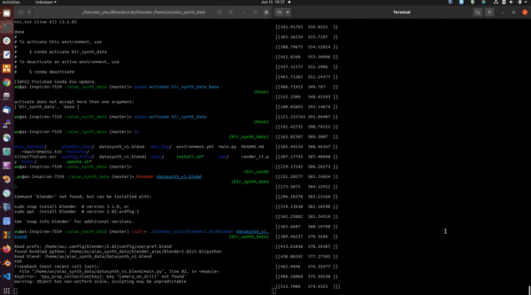

<h1 align="center">rgb-camera-calibration</h1>

<p align="center">
    
</p>

<p align="center">
    Repository for calibrate simple monocular rgb cameras with opencv library.
</p>

</b>

## How it works

**[1]** Capture images with:
```bash
./capture_img.py -I 2
```
Where `-I 2` indicates the index of the camera in respect to your usb ports.

**[2]** For running the calibration use the tag `-H` for the horizontal intern corners of the chessboard's squares, `-V` the same for the vertical and `-S` for the size in mm of a single square:
```bash
./calibrate_camera.py -H 19 -V 13 -S 20
```
You will get out a json like this one:
https://github.com/ibois-epfl/rgb-camera-calibration/blob/ced37c009627c7d429bf723992eb665b6f852c1a/camera_calibration.json#L1-L28

and a [opencv yml](https://docs.opencv.org/4.x/dd/d74/tutorial_file_input_output_with_xml_yml.html) like this:


## A bit of theory behind camera calibration

A camera has two types of parameters which describes itss model: `intrinsics` and `extrinsics`. These parameters describes how the camera works.

The `extrinsics` describes where the camera is in the 3D space, and its describe by a **6D vector** with translation and rotation. If you want to compute *camera localization* you want to compure these parameters:

```
    [X]
    [Y]
v = [Z]
    [α]
    [β]
    [γ]
``` 

On the other hand, the `intrinsics` describes how the camera maps a 3D world point on to the 2D image plane using a *pinhole camera model*. These internal parameters are composed by 4 or 5 elements. If you want to remove *distortion* (e.g. sscaling, skewing, barrel, pincushion or tangential distortion) from your images, this what you need to compute. The opencv methods output this matrix (linear distortion or camera intrisics) and a list of distortion coefficients (non-linear distortion for e.g. barrel correction).

```
    [  fx   0   Δx   
A =    0   fy   Δy
       0    0    1  ]    
```
Where:

`fx`, `fy` = **focal length**, it's the distance between the pinhole and the image plane. It is measured in pixel and these two values, in a true pinhole camera, are almost equivalent. 

`Δx`, `Δy` = **principal point offset**, it's the camera's principal axis, the line perpendicular to the image plane that passes through the pinhole.

